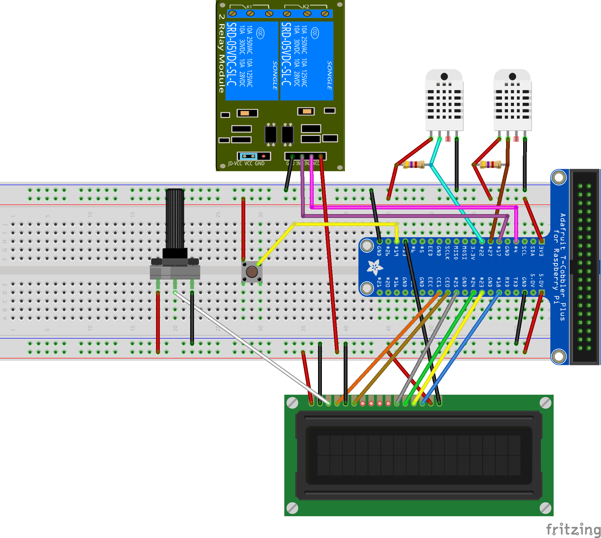

# terraspiV2

Le potentiomètre en **5v** et **GND** et **la pin du milieu** sur **la pin 3 de l'écran LCD**. (sert a régler la luminosité de l' écran)

Le bouton en **3.3v** et **GPIO 19** du Raspberry pi. (sert a lancer la séquence d'affichage)

Le module 2 relais en **5v** et **GND** ,et **l' entrée 1** du relais au **GPIO 17** du Raspberry pi (ce sera le chauffage), et **l' entrée 2** du relais au **GPIO 4** du Raspberry pi (ce sera la lumière).

La sonde pour le point froid, **la pin 1** en** 3.3v** et **la pin 4** au **GND**, **la pin 2** au **GPIO 22** du Raspberry pi.
Il faut placer une résistance de **4.7 kΩ** entre la pin 1 et 2 de la sonde. La pin 3 n'est pas utilisé.

La sonde pour le point chaud, **la pin 1** en **3.3v** et **la pin 4** au **GND**, **la pin 2** au **GPIO 27** du Raspberry pi.
Il faut placer une résistance de **4.7 kΩ** entre la pin 1 et 2 de la sonde. La pin 3 n'est pas utilisé.

Et l'écran LCD:

 * **pin 01 : au GND**
 * **pin 02 : au 5v**
 * **pin 03 : au pin 2 du potentiomètre**
 * **pin 04 : au GPIO 7 du Raspberry pi**
 * **pin 05 : au GND**
 * **pin 06 : au GPIO 8 du Raspberry pi**
 * **pin 07 : non utilisé**
 * **pin 08 : non utilisé**
 * **pin 09 : non utilisé**
 * **pin 10 : non utilisé**
 * **pin 11 : au GPIO 25 du Raspberry pi**
 * **pin 12 : au GPIO 24 du Raspberry pi**
 * **pin 13 : au GPIO 23 du Raspberry pi**
 * **pin 14 : au GPIO 18 du Raspberry pi**
 * **pin 15 : au 5v**
 * **pin 16 : au GPIO 13 du Raspberry pi**
